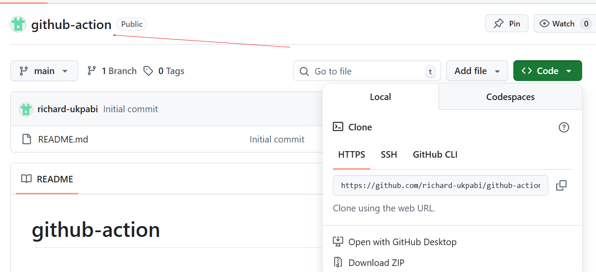
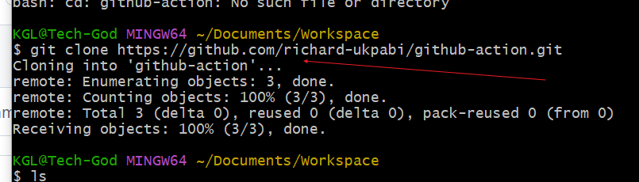
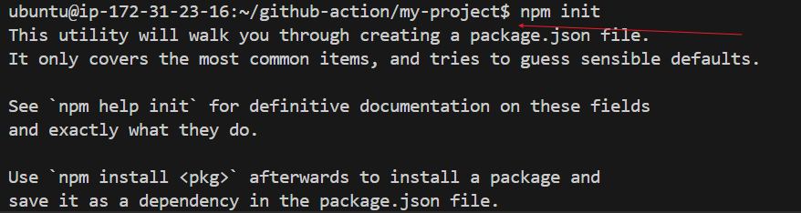
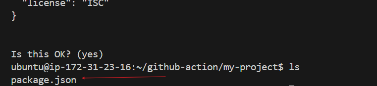

# github-action
 # Introduction to Continous integration and continous deployment/delivery.

A CI/CD pipeline is an automated workflow that moves software from code commit to production deployment. It combines Continuous Integration (CI), where developers frequently merge code into a shared repository with automated builds and tests, and Continuous Delivery/Deployment (CD), which automates packaging and releasing code to staging or production environments.

By automating build, test, and deployment steps, CI/CD pipelines reduce manual errors, speed up releases, and provide rapid feedback to developers, enabling smaller, safer, and more frequent updates.

### Understanding the CICD pipeline.

- Continuous Integration (CI), where developers frequently merge code into a shared repository with automated builds and tests. This typically includes and involves steps like version control, code integration,automated testing and building the application. 

- Continuous Delivery/Deployment (CD), which automates packaging and releasing code to staging or production environments. This typically involves stepss like deploying the application to a staging area or production environment and post deployment monitoring.

## Introduction to Github Actions.
GitHub Actions is GitHub’s built-in CI/CD and automation platform that lets you build, test, and deploy code directly from your repository. It’s event-driven, meaning workflows run when specific repository events occur—like pushes, pull requests, or issue creation.

A workflow is defined in a YAML file inside .github/workflows/ and can run on GitHub-hosted runners (Linux, Windows, macOS) or self-hosted runners for custom environments

Core component of github actions include
- Events – Triggers for workflows (e.g., push, pull_request, schedule).
- Jobs Groups of steps executed on the same runner; can run sequentially or in parallel.
- Steps – Individual tasks, either shell commands or reusable actions.
- Actions – Prebuilt or custom automation units from the GitHub Marketplace.
- Runners – Servers that execute jobs; can be GitHub-hosted or self-hosted.

Practical implementation
- Setting up the project.
1. Initialize a github repository
- create a new repository in github 

- clone to your local machine

2. Create a simple node.js application:
- initialize a Node.js project
 and 

- create a simple server using Express.js to serve a static web page.

